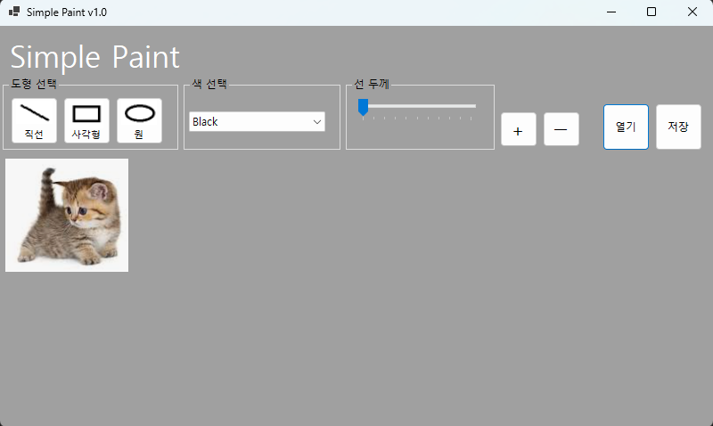
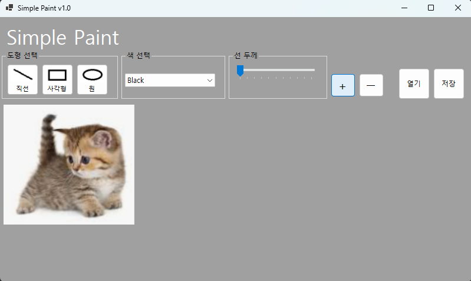

# (C# 코딩) 그림판

## 개요

-C# 프로그래밍학습

-1줄소개: 직선, 사각형, 원을 그릴 수 있는 간단한 그림판 프로그램

-사용한플랫폼: 
	-C#, .NET Windows Forms, Visual Studio, GitHub

-사용한컨트롤:
	-Label, Button, ComboBox, PictureBox, GroupBox, TrackBar

- 사용한 기술과 구현한 기능:
	- 직선, 사각형, 원을 버튼으로 선택하여 그릴 수 있도록 구현
	- 검정, 빨강, 파랑, 초록색을 ComboBox 컨트롤을 통해 선택할 수 있도록 했음
	- TrackBar 컨트롤을 사용하여 선의 굵기를 사용자가 원하는대로 설정 할 수 있도록 구현
	- 사용자가 만든 그림을 저장하거나 외부에서 가져온 사진 파일을 열 수 있음

##실행 화면 (과제1)
- 코드의 실행스크린샷과 구현내용설명

- 구현한내용(위그림참조)
	- Label, Button, ComboBox, PictureBox, GroupBox, TrackBar 컨트롤 사용하여 UI 구성
	- 그릴 도형, 색상, 선 굵기 선택 기능 구현

##실행 화면 (과제2)
- 코드의 실행스크린샷과 구현내용설명

- 구현한내용(위그림참조)
	- 마우스 이벤트를 활용하여 직선, 사각형, 원 그리기 기능 구현

##실행 화면 (과제3)
- 코드의 실행스크린샷과 구현내용설명

- 구현한내용(위그림참조)
	- 마우스로 그린 그림을 저장하는 기능 구현
	- 저장시 3가지 형식(PNG, JPEG, BMP)으로 저장 가능하도록 구현

##실행 화면 (과제4)
- 코드의 실행스크린샷과 구현내용설명

- 구현한내용(위그림참조)
	- 사진 파일을 열 수 있게 구현
	- 확대 축소 버튼 추가, 사진의 크기를 바꿀 수 있음
	- 사진의 크기를 바꿀 때 사진의 크기가 더 크다면 캔버스의 크기도 늘림